# Open Source Data Stack

[](https://airflow.apache.org/)
[](https://www.python.org/)
[](https://docs.getdbt.com/dbt-cli/cli-overview)
[](https://greatexpectations.io/)
[](https://www.postgresql.org/)
[](https://superset.apache.org/)
[](https://www.docker.com/)

On the following project, we are going to integrate `Apache Airflow`, `PostgreSQL`, `dbt`, `Great Expectations` and `Apache Superset`. We are going to do it by using `Apache Airflow` to orchestrate and schedule `dbt` (by running and testing the models) to create the data model on a local `PostgreSQL` database. Use `Great Expectations` to define some further data tests and data profiles, and create a dashboard on `Apache Superset` where we are going to visualize the data. Also, we added two `nignx` servers to host both `dbt` and `Great Expectations` documentation generated.


The idea is not to go through the basics of each technology, but here is a small summary of each one.

## Apache Airflow
`Apache Airflow` is an open-source tool to programmatically author, schedule, and monitor workflows. It is one of the most robust platforms used by Data Engineers for orchestrating workflows or pipelines. You can easily visualize your data pipelines’ dependencies, progress, logs, code, trigger tasks, and success status.

With `Apache Airflow`, users can author workflows as Directed Acyclic Graphs (DAGs) of tasks. `Apache Airflow`’s rich user interface makes it easy to visualize pipelines running in production, monitor progress, and troubleshoot issues when needed. It connects with multiple data sources and can send an alert via email or Slack when a task completes or fails. `Apache Airflow` is distributed, scalable, and flexible, making it well suited to handle the orchestration of complex business logic.

## PostgreSQL
`PostgreSQL` is a powerful, open source object-relational database system with over 30 years of active development that has earned it a strong reputation for reliability, feature robustness, and performance. It is used as the primary data store or data warehouse for many web, mobile, geospatial, and analytics applications.

## dbt
`dbt` is a transformation workflow that lets teams quickly and collaboratively deploy analytics code following software engineering best practices like modularity, portability, CI/CD, and documentation. Now anyone who knows SQL can build production-grade data pipelines.

`dbt` does the *T* in *ELT* (Extract, Load, Transform) processes – it doesn’t extract or load data, but it’s extremely good at transforming data that’s already loaded into your warehouse.

Analysts using `dbt` can transform their data by simply writing select statements, while dbt handles turning these statements into tables and views in a data warehouse.

These select statements, or *models*, form a `dbt` project. Models frequently build on top of one another – `dbt` makes it easy to manage relationships between models, and visualize these relationships, as well as assure the quality of your transformations through testing.

A `dbt` project is a directory of `.sql` and `.yml` files. The directory must contain at a minimum:

- **Models**: A model is a single `.sql` file. Each model contains a single select statement that either transforms raw data into a dataset that is ready for analytics, or, more often, is an intermediate step in such a transformation.
- **A project file**: a `dbt_project.yml `file which configures and defines your dbt project.

Projects typically contain a number of other resources as well, including tests, snapshots, and seed files.

`dbt` connects to your data warehouse to run data transformation queries. As such, you’ll need a data warehouse with source data loaded in it to use dbt. On this project we are going to use `PostgreSQL`.

As a `dbt` user, your main focus will be on writing models (i.e. select queries) that reflect core business logic – there’s no need to write boilerplate code to create tables and views, or to define the order of execution of your models. Instead, dbt handles turning these models into objects in your warehouse for you.

`dbt` handles boilerplate code to materialize queries as relations. For each model you create, you can easily configure a materialization.

A materialization represents a build strategy for your select query – the code behind a materialization is robust, boilerplate SQL that wraps your select query in a statement to create a new, or update an existing, relation.

`dbt` ships with the following built-in materializations:

- **view** (default): The model is built as a view in the database.
- **table**: The model is built as a table in the database.
- **ephemeral**: The model is not directly built in the database, but is instead pulled into dependent models as common table expressions.
- **incremental**: The model is initially built as a table, and in subsequent runs, dbt inserts new rows and updates changed rows in the table.

`dbt` determines the order of model execution. Often when transforming data, it makes sense to do so in a staged approach. dbt provides a mechanism to implement transformations in stages through the *ref* function.

When compiled to executable SQL, `dbt` will replace the model specified in the *ref* function with the relation name.

Importantly, `dbt` also uses the ref function to determine the sequence in which to execute the model. `dbt` builds a directed acyclic graph (DAG) based on the interdependencies between models – each node of the graph represents a model, and edges between the nodes are defined by *ref* functions, where a model specified in a ref function is recognized as a predecessor of the current model.

When `dbt` runs, models are executed in the order specified by the DAG – there’s no need to explicitly define the order of execution of your models. Building models in staged transformations also reduces the need to repeat SQL, as a single transformation (for example, renaming a column) can be shared as a predecessor for a number of downstream models.

`dbt` has a number of additional features that make it even more powerful, including:

- **Code compiler**: In `dbt`, SQL files can contain Jinja, a lightweight templating language. Using Jinja in SQL provides a way to use control structures (e.g. `if` statements and `for` loops) in your queries. It also enables repeated SQL to be shared through macros.

- **Documentation**: `dbt` provides a mechanism to write, version-control, and share documentation for your `dbt` models. Descriptions (in plain text, or markdown) can be written for each model and field.

- **Tests**: SQL can be difficult to test, since the underlying data is frequently changing. `dbt` provides a way to improve the integrity of the SQL in each model by making assertions about the results generated by a model. Out of the box, you can test whether a specified column in a model only contains:
  - Non-null values
  - Unique values
  - Values that have a corresponding value in another model (e.g. a customer_id for an order corresponds to an id in the customers model)
  - Values from a specified list
  - Tests can be easily extended to suit business logic specific to your organization – any assertion that you can make about your model in the form of a select query can be turned into a test.

- **Package management**: `dbt` ships with a package manager, which allows analysts to use and publish both public and private repositories of dbt code which can then be referenced by others.

- **Data snapshots**: Often, records in a data source are mutable, in that they change over time. This can be difficult to handle in analytics if you want to reconstruct historic values. `dbt` provides a mechanism to snapshot raw data for a point in time, through use of snapshots

- **Understand raw data sources**: Since `dbt` selects from raw data already loaded in your data warehouse, it's useful to understand the role of these tables and schemas within your warehouse. Defining raw data as a Source in dbt allows you to:
  - Document and test the data that is loaded into your warehouse
  - Check the freshness of your data against specified limits, to help identify upstream issues.
  - Understand which models depend on each data source.

On this project, we are going to use the data, sources and models defined on `dbt` [Refactoring SQL for Modularity course](https://courses.getdbt.com/courses/refactoring-sql-for-modularity).

For a complete tutorial, you can refer to my [dbt-postgres-tutorial](https://github.com/luchonaveiro/dbt-postgres-tutorial) repository.


## Great Expectations
`Great Expectations` is the leading tool for **validating**, **documenting**, and **profiling** your data to maintain quality and improve communication between teams.

With `Great Expectations`, you can assert what you expect from the data you load and transform, and catch data issues quickly – *Expectations* are basically unit tests for your data. Not only that, but `Great Expectations` also creates data documentation and data quality reports from those *Expectations*. Data science and data engineering teams use `Great Expectations` to:
- Test data they ingest from other teams or vendors and ensure its validity. 
- Validate data they transform as a step in their data pipeline in order to ensure the correctness of transformations. 
- Prevent data quality issues from slipping into data products. 
- Streamline knowledge capture from subject-matter experts and make implicit knowledge explicit. 
- Develop rich, shared documentation of their data.

**Expectations**
*Expectations* are assertions about your data. In `Great Expectations`, those assertions are expressed in a declarative language in the form of simple, human-readable Python methods. 

**Automated data profiling**
Writing pipeline tests from scratch can be tedious and overwhelming. `Great Expectations` jump starts the process by providing automated data profiling. The library profiles your data to get basic statistics, and automatically generates a suite of Expectations based on what is observed in the data.

**Data Validation**
Once you’ve created your *Expectations*, `Great Expectations` can load any batch or several batches of data to validate with your suite of *Expectations*. `Great Expectations` tells you whether each *Expectation* in an *Expectation Suite* passes or fails, and returns any unexpected values that failed a test, which can significantly speed up debugging data issues!

**Data docs**
`Great Expectations` renders *Expectations* to clean, human-readable documentation, which we call Data Docs, see the screenshot below. These HTML docs contain both your *Expectation Suites* as well as your data Validation Results each time validation is run – think of it as a continuously updated data quality report.

## Apache Superset
`Apache Superset` is a modern, enterprise-ready business intelligence web application. It is fast, lightweight, intuitive, and loaded with options that make it easy for users of all skill sets to explore and visualize their data, from simple pie charts to highly detailed deck.gl geospatial charts.

`Apache Superset` is cloud-native and designed to be highly available. It was designed to scale out to large, distributed environments and works very well inside containers. While you can easily test drive `Apache Superset` on a modest setup or simply on your laptop, there’s virtually no limit around scaling out the platform.

`Apache Superset` provides:
- An intuitive interface for visualizing datasets and crafting interactive dashboards
- A wide array of beautiful visualizations to showcase your data
- Code-free visualization builder to extract and present datasets
- A world-class SQL IDE for preparing data for visualization, including a rich metadata browser
- A lightweight semantic layer which empowers data analysts to quickly define custom dimensions and metrics
- Out-of-the-box support for most SQL-speaking databases
- Seamless, in-memory asynchronous caching and queries
- An extensible security model that allows configuration of very intricate rules on on who can access which product features and datasets.
- Integration with major authentication backends (database, OpenID, LDAP, OAuth, REMOTE_USER, etc)
- The ability to add custom visualization plugins
- An API for programmatic customization
- A cloud-native architecture designed from the ground up for scale

## Project Setup

First we should download the [.csv files](https://gist.github.com/coapacetic/d3f20c2e727dc96b830c86da5ad93678) that we are going to insert to the DB. We should download this data on the `db/data` directory.

Once the data is downloaded, we can build the whole project:

```
$ echo -e "AIRFLOW_UID=$(id -u)\nAIRFLOW_GID=0" > .env
$ docker compose up airflow-init
$ docker compose up
```

This commands will run `Apache Airflow` on `localhost:8080`. We can login by using *Airflow* both as user and password. Also, it will create the `PostgreSQL` database were `dbt` is going to store the data models, and `Apache Superset` is going to be connected. And finally, the `docker-compose.yml` is in charge of inserting the downloaded data on the database.

## Apache Airflow DAGs

### DAG with dbt at a project level
The first DAG we will create is a pretty simple one. We can see it on `project_level_dbt_dag` DAG. 

Here, we will just use the `BashOperator` to run and test the whole *jaffle_shop* project. We will have 2 tasks (`dbt_run` and `dbt_test`) that executes `dbt run` to create the whole models on the `PostgreSQL` database, and then execute `dbt test` to test the created models.

The DAG looks something like this:


Where, `dbt_run` is defined as follows:

The models are defined on `dbt/jaffle_shop/models` directory, there you will find the staging, intermediate and final queries that build the whole data model.

And by inspecting its logs, we can see that it runs all the models at once.

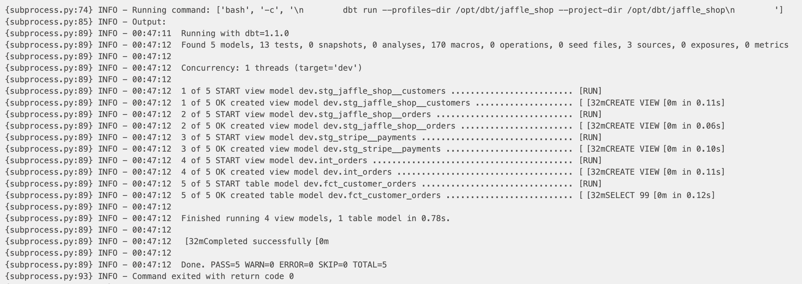

The same with `dbt_test`:

The tests are defined both on the different `.yml` files stored on the `dbt/jaffle_shop/models` directory, and also defined as `.sql` files on the `dbt/jaffle_shop/tests`. This approach can be done in case we need some custom tests that are not covered by `dbt`'s built in ones.

The ones defined on the `.yml` files on the `dbt/jaffle_shop/models` directory, are basicaly in charge of testing the uniqueness and not null of each table primary key. Also, we are testing a relatinship constraint between `jaffle_shop.customers` and `jaffle_shop.orders` tables.

On the other side, on the `dbt/jaffle_shop/tests/assert/positive_total_for_payments.sql` file, we are testing that the payed amount per order id, should always be greater or equal than 0.

And to check that all the tests have passed, let's look at the logs:


So, here we manage to run and test `dbt` models, but one main problem with this approach is that in case any model fails, the task will fail and we should reexecute all the models again after solving the issue with the one that failed. This could be very expensive in time to rebuild all the defined tables.

### DAG with dbt at a model level
We can try instead, of creating one task per defined model, and one task per defined test. We did this on `model_level_dbt_dag` DAG.

To accomplish this, we are going to use the `manifest.json` stored on the `target` directory inside the `dbt` project. In this way we are going to parse all the defined models and tests, and create one task per each. This implementation is based on the following [Astronomer's post](https://www.astronomer.io/guides/airflow-dbt/).

In this case, if one model or test fails, we can reexecute only that one, without rebuilding everything. Also we can group all the model runs under the `dbt_run` taskgroup, and all the model tests under the `dbt_test` taskgroup, so the DAG graph is cleaner. This is also useful when creating some custom slack messages to be sent as a failure callback of any task. So we can quickly get notified whenever some model or test failed and go ahead and spolve the issue.

Also, we are going to add some `dbt_validate` tasks. Particularly the `dbt_compile` one is super important. In csae we add a new model, we should run `dbt compile` first, so the new model is logged on the `manifest.json`, and then the proper task will be created. This also works in case we remove/rename a productive model. We should always recreate the `manifest.json` and keep it fresh.

Also this solution is useful if we want different models to be run in different schedules.

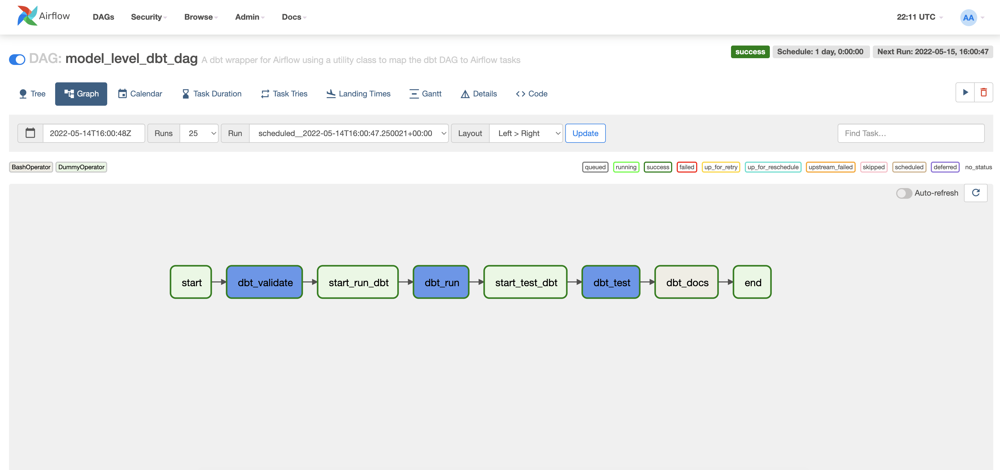

If we open each taskgroup:


At the end of the DAG, we added the `dbt_docs` task, which is in charge of executing the `dbt docs generate` statement. As on the `docker-compose.yml` we added an `nginx` server to host the `dbt` documentation, we can go to `localhost:80` and see the proper documentation of the data model.

Here, for example we can see the documentation generated for the `fct_customer_orders` model:


And here, we can see its lineage graph, where we can observe its dependencies, and the data sources used.


Let's go by parts to understand all the change we proposed here.

**dbt Validate**
First, we included this *TaskGroup* to run the following commands:
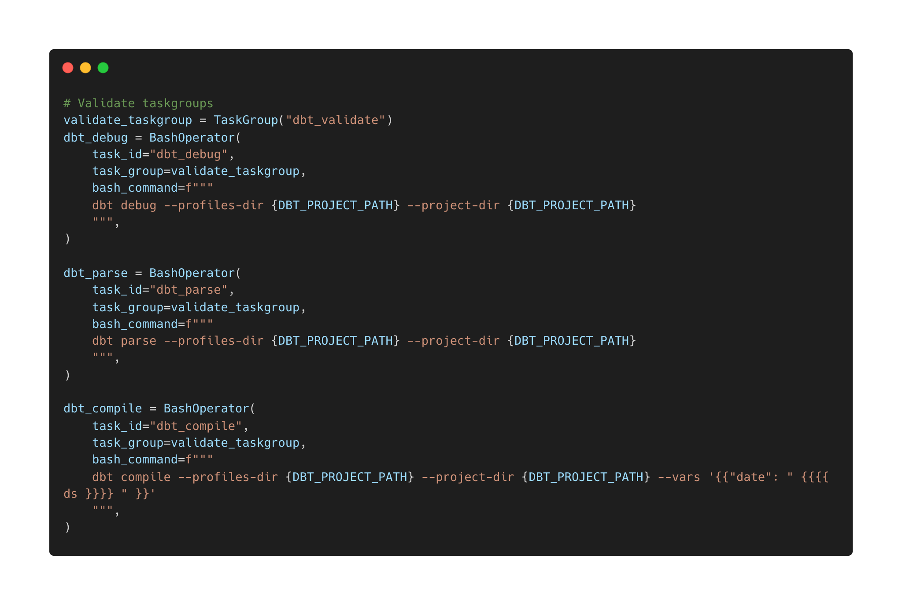
For example, the first task `dbt_debug`, is in charge of testing the connection agains the database. If everything is ok, we should see the following:

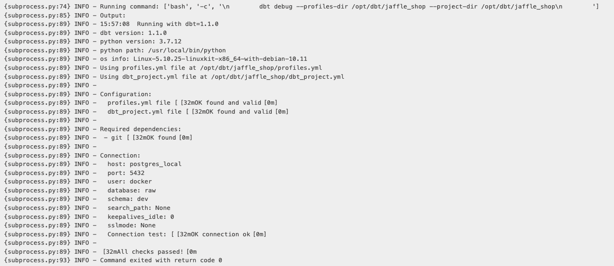

And when running `dbt_compile`, we will refresh the `manifest.json` file:


**dbt Run**
Now, we will have one task per model to run, all grouped under the same *TaskGroup* The dependencies are taken from the `manifest.json` file, so we will keep the desired consistency on the running of the models. Let's look for example to the logs generated after running `model.jaffle_shop.fct_customer_orders` model, there we will find both the command executed and the dbt log:


**dbt Test**
We also grouped all the tests together on the same `TaskGroup` and we see that there is one task per test. Let's look the log of `test.jaffle_shop.assert_positive_total_for_payments` to check everything went fine:


**dbt Docs**
This task is responsible of executing the following command:

Generating the `.html` file that is hosted on `localhost:80`.


### DAG with dbt at a model level with Great Expectations
Of course we can rely on `dbt`'s testing suite to create more complex tests, such as the one we created on `jaffle_shop/tests/assert_positive_total_for_payments.sql`, but what if we want to use `Great Expectations` library? How can we include it on our current project?

For this, we created the `model_level_dbt_great_expectations_dag` adding some tasks to the previous DAG. We are going to use the `GreatExpectationsOperator` that we can find on the `airflow-provider-great-expectations` library. Here I decided to split the `Great Expectations` validations in 2: *sources* and *targets*. The *sources* validations we are going to execute them at the beginning of the DAG, and the *targets* validations, at the end, after running the `dbt` models.


Where `great_expectations_sources` is in charge of validating the three source tables, while `great_expectations_targets` validates `dev.fct_customer_orders` table. This can be seen when expanding the *TaskGroups*

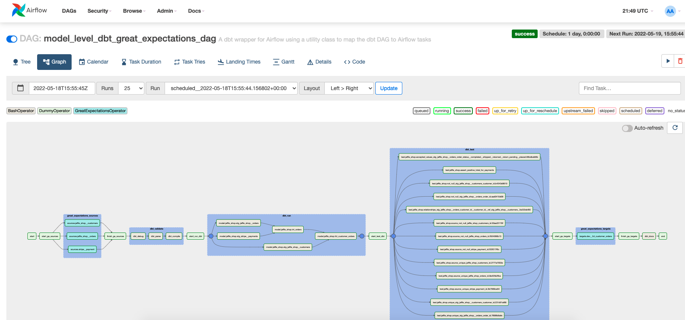

When executing `targets.dev__fct_customer_orders` we can see the logs to check that the validations passed ok:

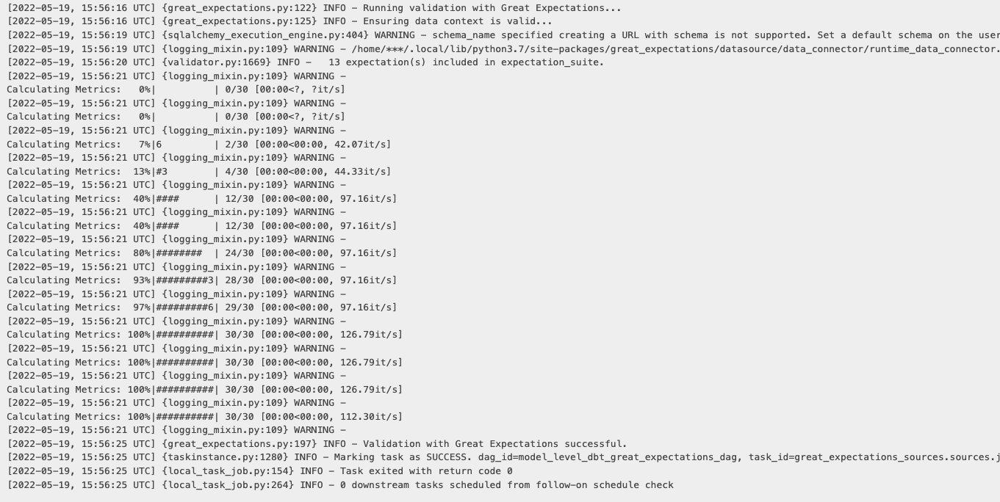

To further understand how to create the *Expectations*, you can check my [great-expectations-postgres-tutorial](https://github.com/luchonaveiro/great-expectations-postgres-tutorial) repository.

But basically, we can find all the defined validations on the `great_expectations` directory. There I defined different expectations for different tables: `jaffle_shop.customers`, `jaffle_shop.orders`, `stripe.payment` and `dev.fct_customer_orders`. The expectations defined are in charge of validating the columns data types, uniqueness and not null values of the tables primary key.

Here, also we added another `nginx` server to host the `Great Expectations` documentation, we can go to `localhost:81` and see the runs results and the defined validations on each table.

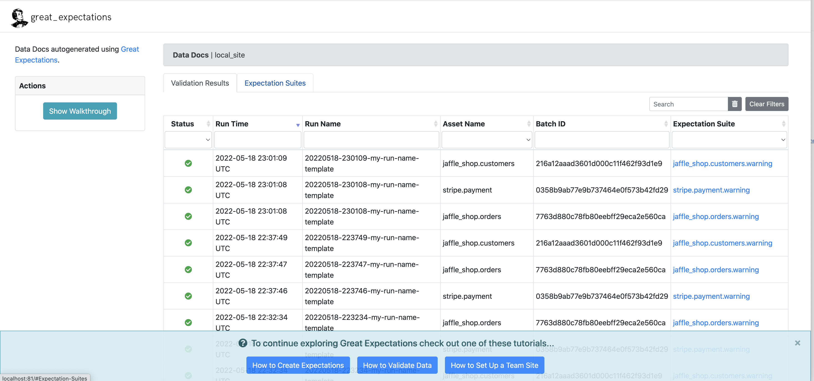

## Apache Superset

The final part of this project, is to connect the data model to a visualization tool. For this we are going to use `Apache Superset` and connect it to the `PostgreSQL` database, so time the model runs and updates the data model, we can visaulize the new data. 

To do so, we are going to use `Apache Superset` official `docker-compose.yml` file and build it. The file can be found [here](https://github.com/apache/superset/blob/master/docker-compose-non-dev.yml). The only thing we should do, is to attach the same network as the one where `Airflow` and `PostgreSQL` are running. We can add this at the end of the `.yml` file:

```
networks:
  default:
    external: true
    name: open-source-data-stack_default
```

Now we can build `Apache Superset` by running:
```
$ cd superset
$ docker-compose -f docker-compose-non-dev.yml up
```

This will run `Apache Superset` at `localhost:8088`, we can access by using *admin* as both user and password. Once we log in, we can create the connection to the database.


We also need to create a dataset, that will be the same `dev.fct_customer_orders` table. 

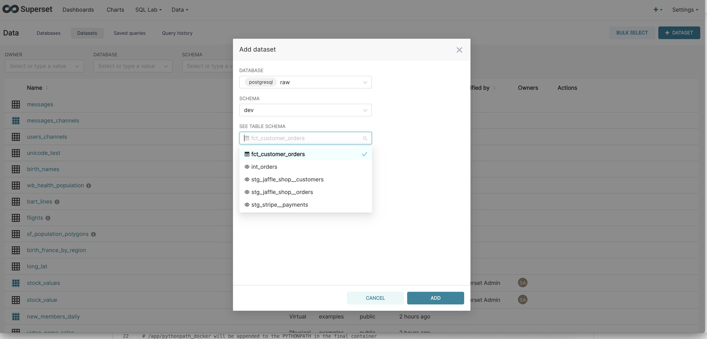

Once created, we can start creating charts to create our **Jaffle Shop** dashboard. We will create two plots: 
- *Daily Orders*: is counting the orders grouped by order_date
- *Daily LTV*: is summing the customer_lifetimevalue per order_date

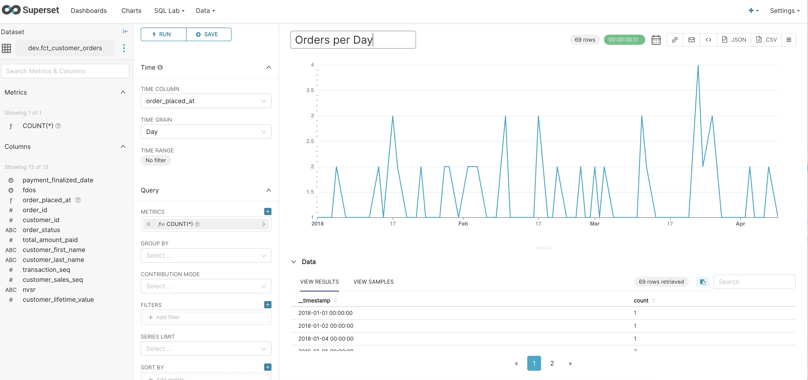


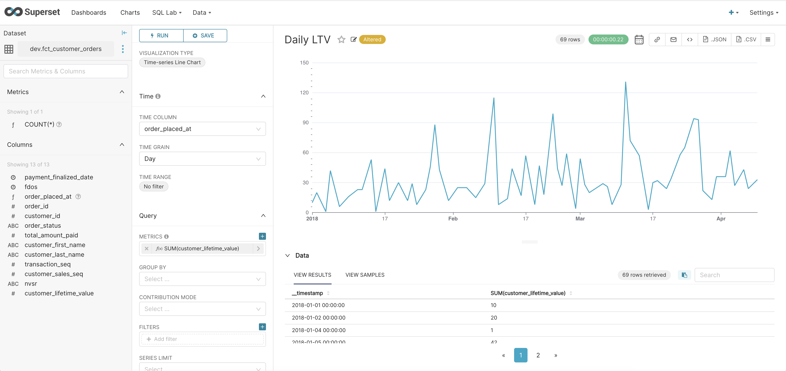

Also we are going to create a filter, to filter by **Customer ID** in case we want to. In this way, we have created our **Jaffle Shop** dashboard.

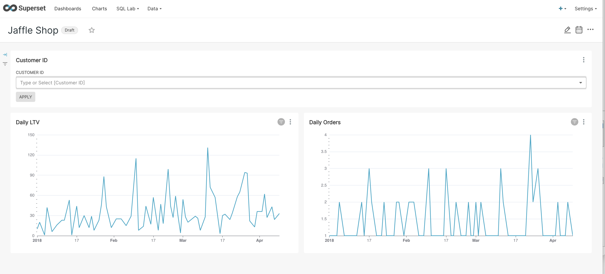

